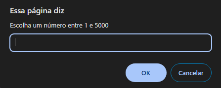
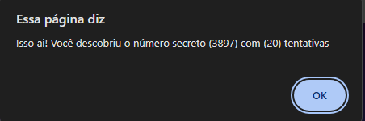

# Game-JS

Este projeto consiste em um jogo simples de adivinhação de números desenvolvido utilizando HTML, CSS e JavaScript. O computador escolhe um número aleatório entre 1 e 5000, e o jogador tenta adivinhar qual é esse número.

## Como Jogar

1. **Requisitos:**
   - Navegador web moderno com suporte a JavaScript.

2. **Instruções:**
   - Abra o arquivo `index.html` em seu navegador.
   - Digite um número no campo de entrada.
   - Clique no botão "Enviar" para verificar se o número que você digitou é igual ao número secreto escolhido pelo computador.
   - O jogo informará se o número que você digitou é muito alto, muito baixo ou se você acertou o número secreto.

3. **Exemplo do Campo de Entrada:**
   
   
   
   
   **Exemplo do Campo de Entrada com o Resultado:**
   
   
   
   
   **Exemplo de Interface:**
   
   

## Recursos

- Implementação utilizando HTML para a estrutura da página.
- Estilização da interface feita com CSS para uma experiência visual agradável.
- Lógica do jogo desenvolvida em JavaScript para interação dinâmica e validação das entradas do usuário.

## Estrutura de Arquivos

- `index.html`: Arquivo principal que contém a estrutura da página do jogo.
- `style.css`: Arquivo CSS para estilização da interface.
- `app.js`: Arquivo JavaScript com a lógica do jogo.

## Contribuição

Contribuições são bem-vindas! Se você quiser melhorar este jogo, sinta-se à vontade para enviar um pull request.

## Autor

- Desenvolvido por [Gabriele]([https://github.com/gabrieletorresr).

## Licença

Este projeto está licenciado sob a Licença MIT - veja o arquivo [LICENSE](./LICENSE) para mais detalhes.

---

